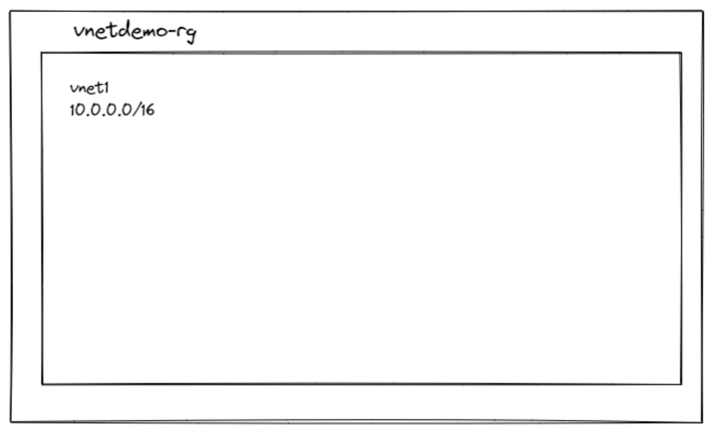

# Configure the network for your virtual machines

Learn more!:

- [Configure virtual networks](https://docs.microsoft.com/learn/modules/configure-virtual-networks/)
- [Configure the network for your virtual machines](https://docs.microsoft.com/learn/modules/configure-network-for-azure-virtual-machines/)
- [Azure VNet FAQ](https://docs.microsoft.com/azure/virtual-network/virtual-networks-faq)
- [Azure Networking Deep Dive](https://social.technet.microsoft.com/wiki/contents/articles/52852.azure-networking-deep-dive-in-vnet-subnets.aspx)

 ## What is Azure virtual networking?

 Azure virtual networks provide key capabilities:

- Isolation and segmentation
- Communicate to the internet
- Communicate between Azure resources
- Communicate with on-premises resources
- Route network traffic
- Filter network traffic
- Connect virtual networks

## What is an Azure Virtual Network (VNet)?

An Azure Virtual Network (VNet) is a representation of your own network in the cloud. It is a logical isolation of the Azure cloud dedicated to your subscription. 

VNets can be used in many ways:

- **Create a dedicated private cloud-only VNet:** Sometimes you don't require a cross-premises configuration for your solution. When you create a VNet, your services and VMs within your VNet can communicate directly and securely with each other in the cloud. You can still configure endpoint connections for the VMs and services that require internet communication, as part of your solution.

- **Securely extend your data center With VNets:** You can build traditional site-to-site (S2S) VPNs to securely scale your datacenter capacity.

- **Enable hybrid cloud scenarios:** VNets give you the flexibility to support a range of hybrid cloud scenarios. You can securely connect cloud-based applications to any type of on-premises system such as mainframes and Unix systems.



## Subnets 

Subnets provide logical divisions within your virtual network and a VNet can be segmented into one or more subnets. 

Each subnet contains a range of IP addresses that fall within the VNet address space. 

- The range must be unique within the address space for the virtual network.
- The range can't overlap with other subnet address ranges within the virtual network.
- The address space must be specified by using the Classless Inter-Domain routing (CIDR) notation.
- Azure reserves 5 IP addresses within each subnet. These are x.x.x.0-x.x.x.3 and the last address of the subnet. x.x.x.1-x.x.x.3 is reserved in each subnet for Azure services.

    - x.x.x.0: Network address
    - x.x.x.1: Reserved by Azure for the default gateway
    - x.x.x.2, x.x.x.3: Reserved by Azure to map the Azure DNS IPs to the VNet space
    - x.x.x.255: Network broadcast address for subnets of size /25 and larger. This will be a different address in smaller subnets.


## IP addressing


- **Private IP addresses:** Used for communication within an Azure virtual network (VNet), and your on-premises network, when you use a VPN gateway or ExpressRoute circuit to extend your network to Azure.

- **Public IP addresses:** Used for communication with the Internet, including Azure public-facing services.


### Static vs Dynamic addresses assignments

IP addresses can also be statically assigned or dynamically assigned. 

Static IP addresses do not change and are best for certain situations such as:

- DNS name resolution, where a change in the IP address would require updating host records.
- IP address-based security models that require apps or services to have a static IP address.
- TSL/SSL certificates linked to an IP address.
- Firewall rules that allow or deny traffic using IP address ranges.
Role-based VMs such as Domain Controllers and DNS servers.

- Dynamic addresses can change when the resource is deallocated.

- Static addresses aren't released until a public IP address resource is deleted. If the address isn't associated to a resource, you can change the assignment method after the address is created.

## Demo

Let's create a VNet, two subnets, a VM in each one, and make sure we can RDP into both, and ping both.


1. Create a resource group

    ```sh
    az group create -g vnetdemo-rg -l eastu2
    ```

2. Create a vnet and a subnet

    ```sh
    az network vnet create -g vnetdemo-rg -n Vnet1 --address-prefix 10.0.0.0/16 --subnet-name Subnet1 --subnet-prefix 10.0.0.0/24
    ```
    The JSON output will give us details of what we just created, which we could also get by running the `az network vnet show` command.

3. Next let's create the Subnet2
    ```sh
    az network vnet subnet create --name subnet2 --vnet-name Vnet1 -g vnetdemo-rg --address-prefixes 10.0.2.0/24
    ```

    Let's run a query to make sure our Vnet1 has both subnets associated with it.

    ```sh
    az network vnet show -g vnetdemo-rg -n Vnet1 --query "subnets"
    ``` 

4. Create VM1

    ``` sh
    az vm create -g vnetdemo-rg -l eastus2 --image  MicrosoftWindowsServer:WindowsServer:2016-Datacenter:latest --vnet-name demovnet1 -n vm1 --subnet Subnet1
    ```

    Since we are using a Windows VM, port 3389 is opened automatically when we create it. 

5. Create VM2

    ``` sh
    az vm create -g vnetdemo-rg -l eastus2 --image  MicrosoftWindowsServer:WindowsServer:2016-Datacenter:latest --vnet-name demovnet1 -n vm2 --subnet Subnet2
    ```

6. Remove the public IP from vm2

    ```sh
    az network nic ip-config update --name ipconfigvm2 -g vnetdemo-rg --nic-name vm2VMNIC --remove PublicIpAddress
    ```

    You can use this command if you need to get the NIC of your VM.

    ```sh
    az vm nic list -g vnetdemo-rg --vm-name vm2
    ```

    You can use this command if you need to get the ip-config of your nic VM

    ```sh
    az network nic ip-config list --nic-name vm2VMNIC -g vnetdemo-rg -o table
    ```